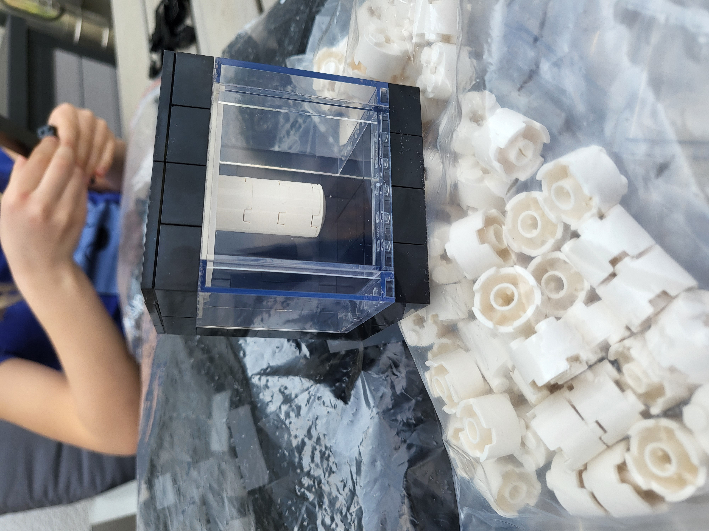
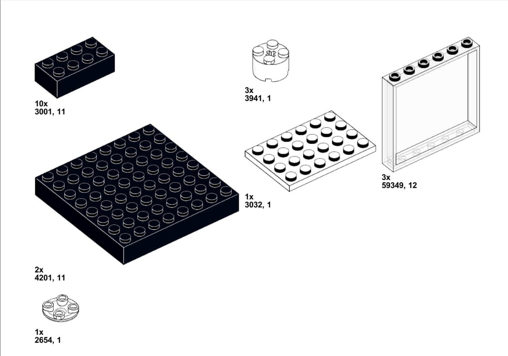

# Quantego

## Quantego is a Lego model of the IBM Quantum System One quantum computer

It has been mentioned first on LinkedIn in [December 2021](https://www.linkedin.com/feed/update/urn:li:activity:6875070856679231488/) and again in [April 2022](https://www.linkedin.com/feed/update/urn:li:activity:6920362102687723520/).

  

This GitHub repo features a slightly simplified version made of 20 bricks.

## Instructions

The [instructions](lego-quantego-v04b.pdf) have been created with the http://stud.io lego digital design software. Part numbers are as on https://www.bricklink.com/. Colors are black for the 2x4 and 8x8 bricks, "trans-clear" for the panels (i.e. glass windows), and white for the other three types of bricks. 

  

## Modifications

Optional modifications might be to replace some of the 2x4 bricks (step 3) with 2x2 bricks to improve stability of the rack, or to replace the 8x8 bricks (step 2 and step 5) with 2x4 bricks which might be easier and cheaper to buy. In that case, 2x4 tiles can be added to improve stability of the top and base.

In case you modify the model - or build you own quantum computer model - please let us know by creating an issue or pull request.

---
This GitHub project is not affiliated in any way with Lego nor bricklink. 
