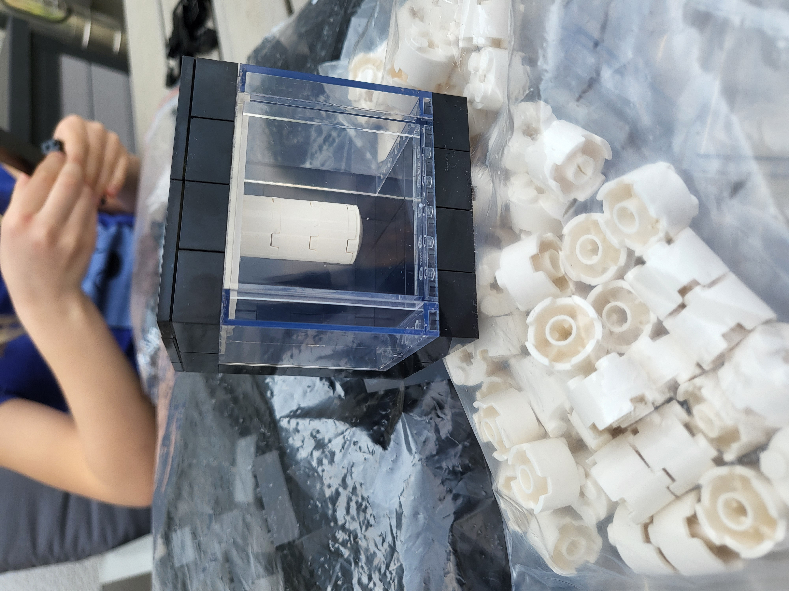
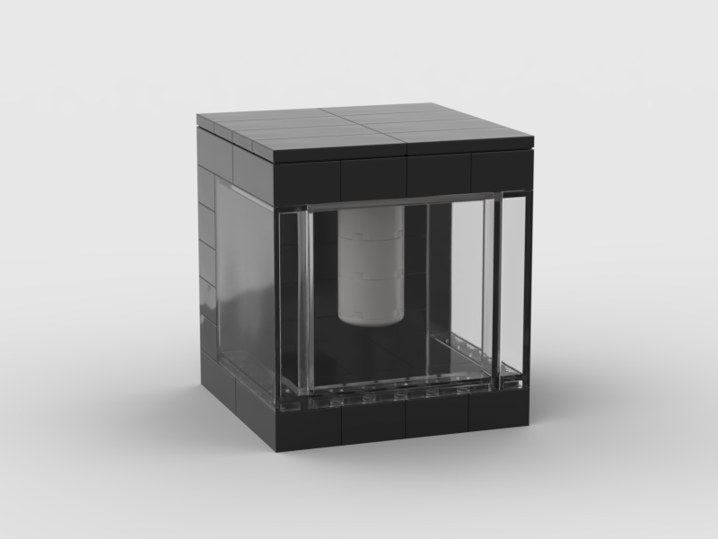
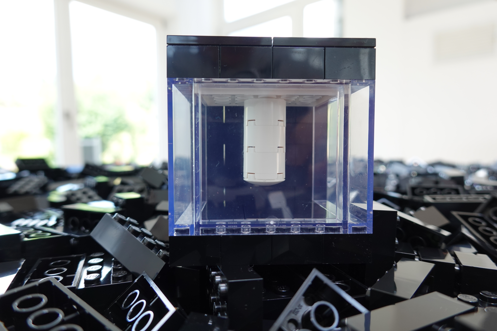
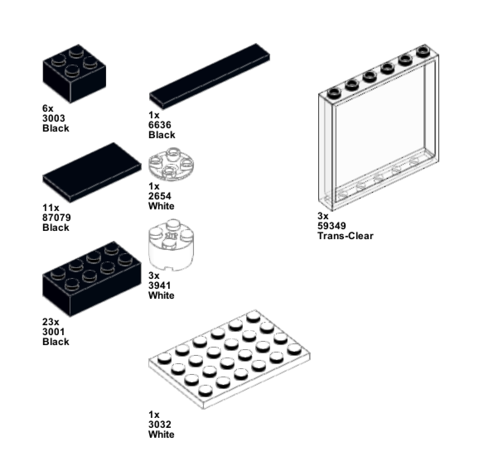
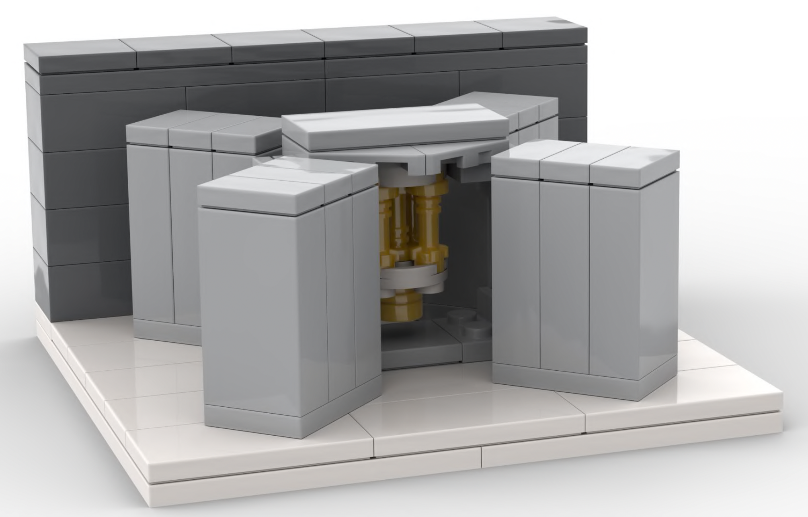
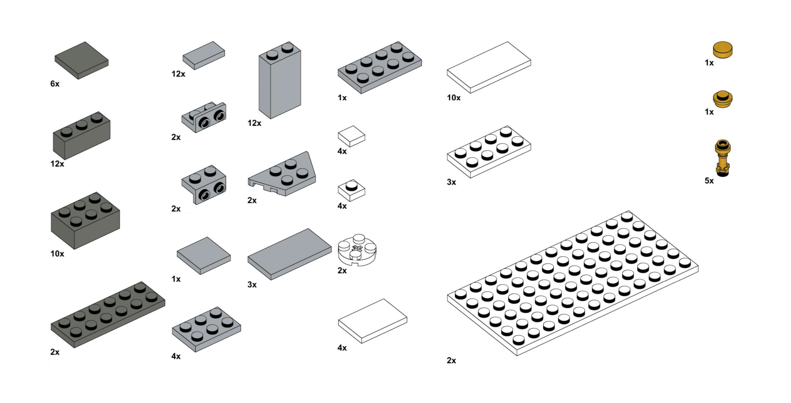

# Quantego

## Quantego is a family of Lego models of IBM Quantum Computers

The first version of Quantego has been created by Mathilda Lahmann, as mentioned on LinkedIn in [December 2021](https://www.linkedin.com/feed/update/urn:li:activity:6875070856679231488/) and in [April 2022](https://www.linkedin.com/feed/update/urn:li:activity:6920362102687723520/).

  

Currrently, we feature two differnt versions:
A Lego mode of IBM Quantum System *One* made of 49 bricks and a model of IBM Quantum System *Two* made of 105 bricks. 

For each of the models, build instructions and a parts list is being made available. 
The instructions and the digital pictures and animations have been created with the [stud.io](http://stud.io) lego digital design software. Part numbers (3001, 4201, etc) are as on [bricklink](https://www.bricklink.com/). 

We expect to make a much more sophisticated model of IBM Quantum System Two - made of 1024 bricks - available very soon. Stay tuned.

## IBM Quantum System One

  

  
  
  

### Build instructions 
Build instructions can be found [here](Quantego-One/Quantego-One-v05-instructions.pdf)

### Parts List

  

### Digital design

The digital design file is available [here](Quantego-One/Quantego-One-v05.io). This .io file can be imported into bricklink [studio](http://stud.io) and used to order the bricks at any of the [bricklink](https://www.bricklink.com/) shops.

## IBM Quantum System Two

  

### Build instructions 
Build instructions can be found [here](Quantego-Two/Quantego-Two-instructions.pdf)

### Parts List

  

### Digital design

The digital design file is available [here](Quantego-Two/Quantego-Two.io). This .io file can be imported into bricklink [studio](http://stud.io) and used to order the bricks at any of the [bricklink](https://www.bricklink.com/) shops.

## High-end model of IBM Quantum System Two

coming very soon

## Kits

A small internet shop provides complete kits of these models at [Quantego.biz](https://Quantego.biz). 

## RasQberry

In case you would like to build a **functional model** of the IBM Quantum System One quantum computer, based on 3D printing, a [Raspberry Pi](https://www.raspberrypi.org) mini computer and [Qiskit](http://qiskit.org) (IBM's open source quantummm computing software framework), have a look at [rasqberry.org](http://rasqberry.org).

---
This GitHub project is not affiliated in any way with Lego nor bricklink. 
LEGO and BrickLink are trademarks of the LEGO Group.

