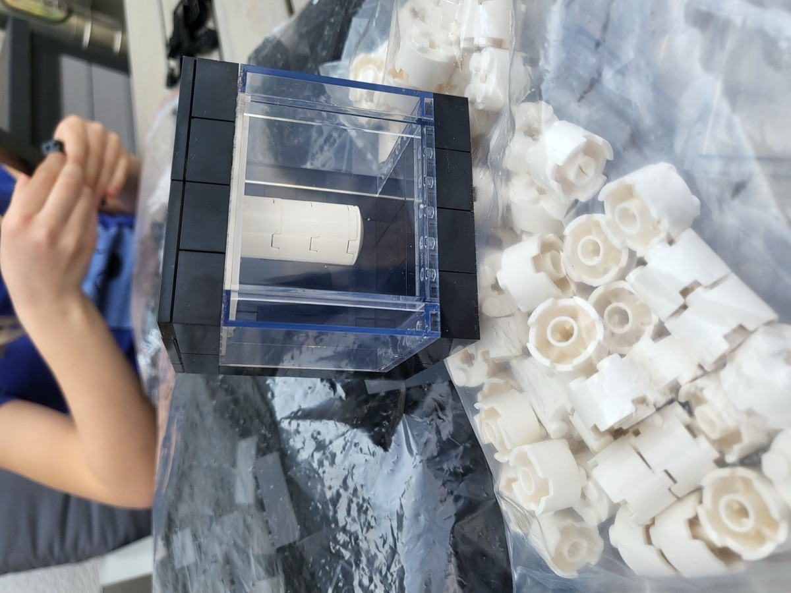
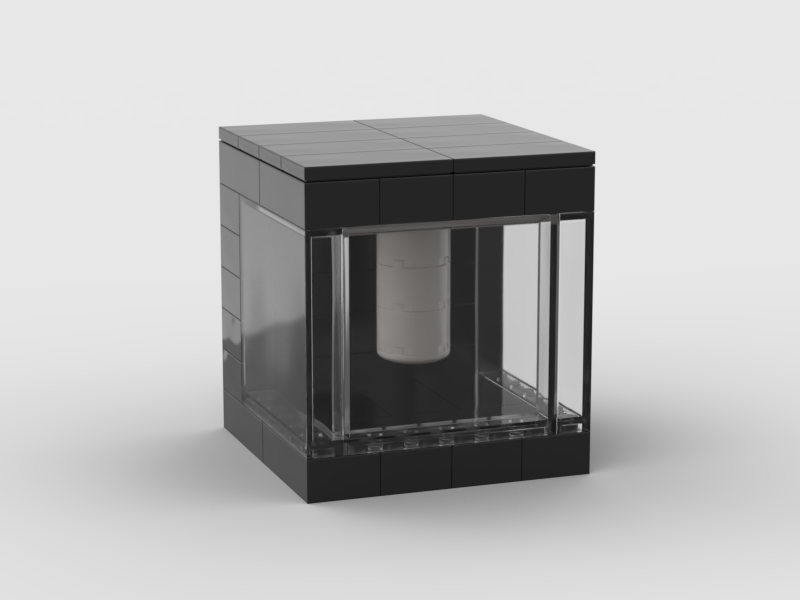
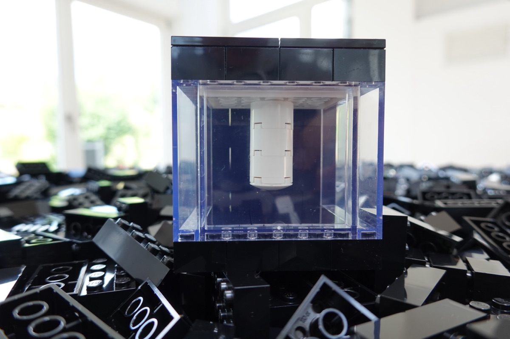
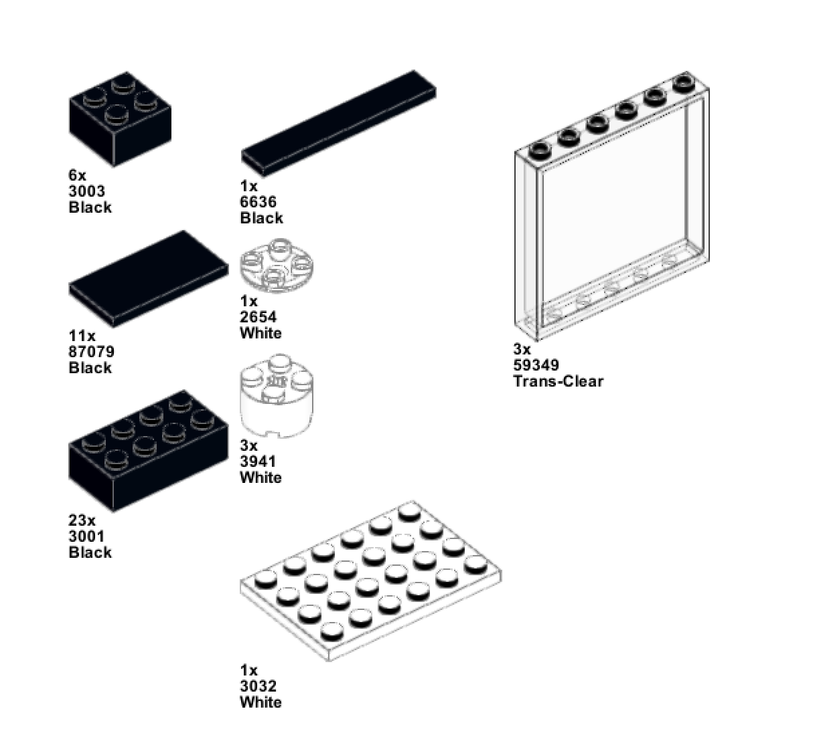
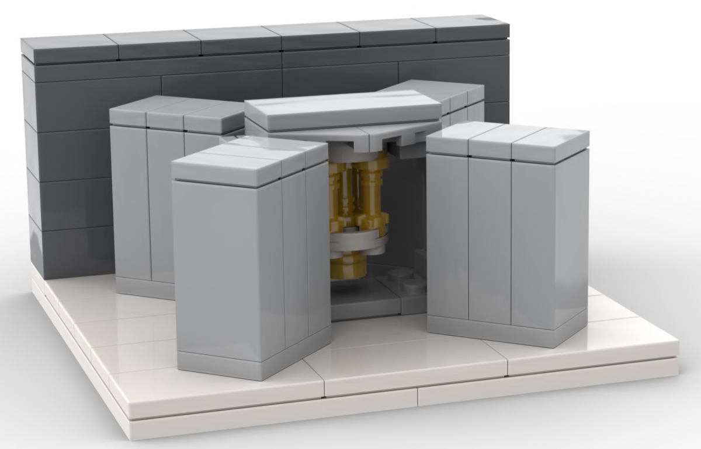
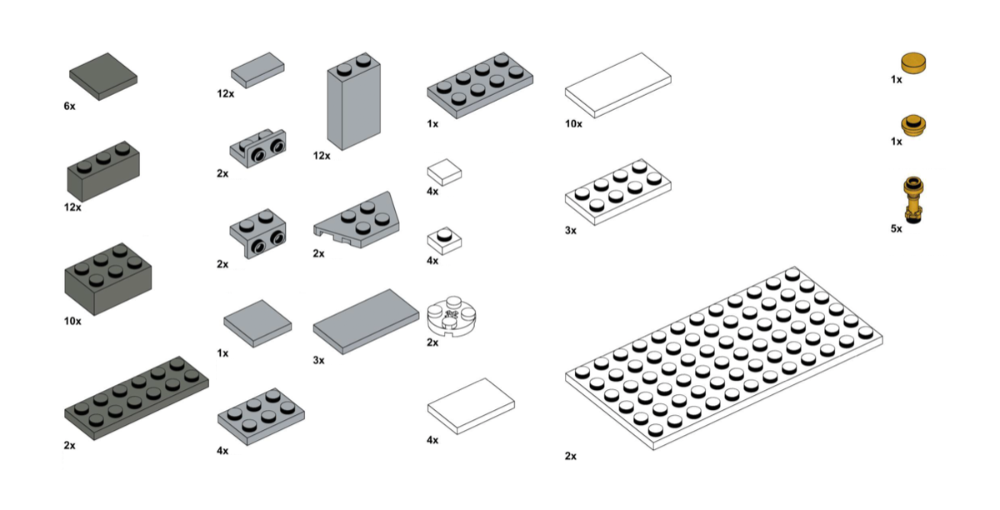
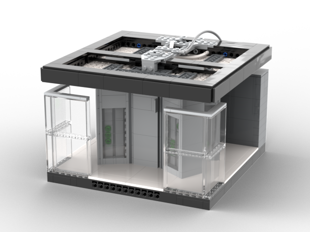
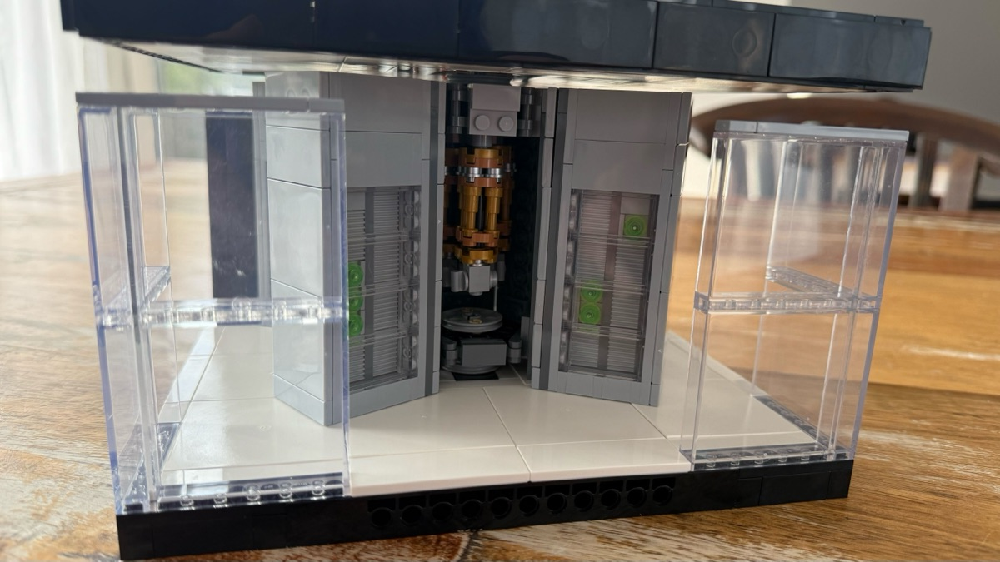
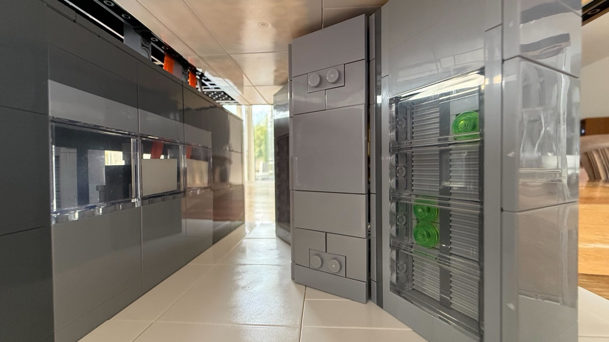

# Quantego

## Quantego is a family of LEGO models of IBM Quantum Computers

<link rel="stylesheet" href="/assets/css/viewer.css">

The first version of Quantego was created by Mathilda Lahmann, as mentioned on LinkedIn in [December 2021](https://www.linkedin.com/feed/update/urn:li:activity:6875070856679231488/) and in [April 2022](https://www.linkedin.com/feed/update/urn:li:activity:6920362102687723520/).

  

Currently, we feature three different versions: a LEGO model of IBM Quantum System *One* (49 bricks), a model of IBM Quantum System *Two* (105 bricks), and a much more sophisticated, high-end model of IBM Quantum System Two (1024 bricks).

For each of the models, build instructions and a parts list are provided.
The instructions, digital pictures, and animations were created with [BrickLink Studio](https://www.bricklink.com/v3/studio/main.page) LEGO digital design software. Part numbers (3001, 4201, etc.) are as on [BrickLink](https://www.bricklink.com/).

## IBM Quantum System One

  

  
  
  

💡 **This 3D viewer is interactive — like all of them on this page.** Drag to rotate (a click on the background pauses or resumes the slow spin) and step through the build with the ‹ › buttons: every step highlights its new bricks and lists exactly which parts to add, like interactive build instructions. Switch the play bar from **Bricks** to **Steps** and the ▶ button and progress bar play or scrub through whole building steps — the fastest way to jump to a specific step, especially in the 1024-brick model. Click any brick to identify it, open the 🧱 parts list, or take the ℹ️ tour to learn what each part of a real quantum computer does. The 📸 button saves a snapshot, and 🔗 copies a link to your exact view.

### Build instructions 
Build instructions can be found [here](Quantego-One/Quantego-One-v05-instructions.pdf)

### Parts List

  

### Digital design

The digital design file is available [here](Quantego-One/Quantego-One-v05.io). This .io file can be imported into [BrickLink Studio](https://www.bricklink.com/v3/studio/main.page) and used to order the bricks at any of the [BrickLink](https://www.bricklink.com/) shops. The model is also available in the open [LDraw format](Quantego-One/Quantego-One-v05.ldr) (`.ldr`), which is what powers the interactive 3D viewer above.

## IBM Quantum System Two

  

### Run a quantum circuit

The real machine runs *quantum circuits* — so here is one you can play with. Place an **H** gate to put a qubit into superposition, add a **CNOT** to entangle it with another qubit (click once to place the control ●, then click the target ⊕), and press run: the circuit is simulated right in your browser and measured 1024 times. Every run makes the golden *chandelier* inside the cryostat of the model above flash — that is where the qubits live, at 15 millikelvin, and this model lets you look right at them. Try the *Bell pair* preset — the two entangled qubits always agree, no matter how often you measure. Prefer it simpler? Switch the simulator down to one or two qubits.

### Build instructions 
Build instructions can be found [here](Quantego-Two/Quantego-Two-instructions.pdf)

### Parts List

  

### Digital design

The digital design file is available [here](Quantego-Two/Quantego-Two.io). This .io file can be imported into [BrickLink Studio](https://www.bricklink.com/v3/studio/main.page) and used to order the bricks at any of the [BrickLink](https://www.bricklink.com/) shops. The model is also available in the open [LDraw format](Quantego-Two/Quantego-Two.ldr) (`.ldr`), which is what powers the interactive 3D viewer above.

## High-end model of IBM Quantum System Two

[Luca Crippa](https://www.linkedin.com/in/luca-crippa-a29a98a2/) has designed a sophisticated and beautiful 1024-brick model of IBM Quantum System Two.

  

You'll find more renders of the 1024-brick model in the [Renders](https://github.com/JanLahmann/Quantego/tree/main/Quantego-Two-1024/Renders) folder.

Here are some photos of the built model; more will be posted in the [Photos](https://github.com/JanLahmann/Quantego/tree/main/Quantego-Two-1024/Photos) folder.

  
  

### Build instructions 
Build instructions can be found [here](Quantego-Two-1024/Quantego-Two-1024_v3_instructions.pdf).

### Parts List
Parts list can be found at the end of the build instructions file. You can also download [this json](Quantego-Two-1024/Quantego-Two-1024_v3_PAB.json) and upload it on the official Lego Pick a Brick website of your Country ([example](https://www.lego.com/en-us/pick-and-build/pick-a-brick)) to purchase all the parts directly from Lego. Just upload the json by clicking on the "Upload List" button.

### Digital design

The digital design file is available [here](Quantego-Two-1024/Quantego-Two-1024_v3_studio.io). This .io file can be imported into [BrickLink Studio](https://www.bricklink.com/v3/studio/main.page). The model is also available in the open [LDraw format](Quantego-Two-1024/Quantego-Two-1024_v3_studio.ldr) (`.ldr`), which is what powers the interactive 3D viewer above.

### Disclaimer
This 1024-brick model has been designed by LEGO amateurs (not professionals): due to its rather complex design, it could be subject to issues. Any feedback for improvement is welcome!

## Superposition

A qubit does not have to choose between 0 and 1. Until it is measured, it can be in a *superposition*: both states at once, each carried with its own weight — the *amplitude*. A measurement forces the decision: the outcome is random, 0 or 1, with probabilities given by the squares of those amplitudes — and the superposition is gone.

Here is our LEGO take on it. The model below is System One *and* System Two at the same time, in an equal superposition. Click it to measure: it collapses to one of the two machines, each with 50% probability, and stays that way until the next click (or the glowing **0/1** button) prepares a new superposition.

## Compare the models

All three models shown side by side at the same physical scale. Drag to rotate, scroll or pinch to zoom.

## Kits

A small internet shop provides complete kits of these models at [Quantego.biz](http://Quantego.biz). 

## RasQberry

In case you would like to build a **functional model** of the IBM Quantum System One quantum computer, based on 3D printing, a [Raspberry Pi](https://www.raspberrypi.org) mini computer and [Qiskit](http://qiskit.org) (IBM's open source quantum computing software framework), have a look at [rasqberry.org](http://rasqberry.org).

---
This GitHub project is not affiliated in any way with Lego, bricklink, nor IBM. 
LEGO and BrickLink are trademarks of the LEGO Group. IBM and IBM Quantum are trademarks of International Business Machines Corporation.

### Acknowledgments

The interactive 3D viewers are built with [three.js](https://threejs.org) (`LDrawLoader` and `OrbitControls`) and use the [LDraw™ Parts Library](https://www.ldraw.org) (parts geometry is licensed [CC BY](https://www.ldraw.org/article/745.html)). Augmented-reality viewing is powered by [&lt;model-viewer&gt;](https://modelviewer.dev). The quantum circuit simulator is a self-contained statevector simulation that runs entirely in your browser. The models were designed in [BrickLink Studio](https://www.bricklink.com/v3/studio/download.page).

